Exploratory Data Analysis of the Athletes from Rio 2016 Olympic Games 
========================================================
### by Ananda Sales Ribeiro


## Introduction
This report performs an Exploratory Data Analysis over a dataset that contains information about athletes who have competed in Rio 2016 Olympic Games.  
Several aspects may influence an athlete performance, such as the training, health, welfare, physical characteristics, determination and support from the family. In this project it will be analyzed how some characteristics of the athletes are related to their results in the Olympic Games and which are the characteristics of the athletes with better results. The following features will be analyzed:  
Nationality, age, height and weight. The results will be measured through the number and type of medals won.  

The criteria used to evaluate if an athlete had a better result than the other will be the total number of medals won and the type of medals won (gold, silver of bronze).


## Dataset

The dataset athletes.csv was downloaded from the Kaggle website through the link below:  
https://www.kaggle.com/rio2016/olympic-games

This is the description of the dataset: "This dataset consists of the official statistics on the 11,538 athletes and 306 events at the 2016 Olympic Games in Rio de Janeiro. The athletes file includes the name, nationality (as a three letter IOC country code), gender, age (as date of birth), height in meters, weight in kilograms, sport, and quantity of gold, silver, and/or bronze medals won for every Olympic athlete at Rio."  
The events will not be analyzed in this project. 

All the variables in the dataset are listed below:

```
##  [1] "id"          "name"        "nationality" "sex"         "dob"        
##  [6] "height"      "weight"      "sport"       "gold"        "silver"     
## [11] "bronze"
```

And this is the structure of the dataframe:

```
## 'data.frame':	11538 obs. of  11 variables:
##  $ id         : int  736041664 532037425 435962603 521041435 33922579 173071782 266237702 382571888 87689776 997877719 ...
##  $ name       : Factor w/ 11517 levels "A Jesus Garcia",..: 1 2 3 4 5 6 7 8 9 10 ...
##  $ nationality: Factor w/ 207 levels "AFG","ALB","ALG",..: 60 103 34 120 142 11 199 11 60 62 ...
##  $ sex        : Factor w/ 2 levels "female","male": 2 1 2 2 2 2 2 2 1 1 ...
##  $ dob        : Factor w/ 5596 levels "","1/1/69","1/1/73",..: 624 5380 3536 196 1231 314 4093 5415 1473 4412 ...
##  $ height     : num  1.72 1.68 1.98 1.83 1.81 1.8 2.05 1.93 1.8 1.65 ...
##  $ weight     : int  64 56 79 80 71 67 98 100 62 54 ...
##  $ sport      : Factor w/ 28 levels "aquatics","archery",..: 3 10 3 23 8 25 26 1 3 3 ...
##  $ gold       : int  0 0 0 0 0 0 0 0 0 0 ...
##  $ silver     : int  0 0 0 0 0 0 0 0 0 0 ...
##  $ bronze     : int  0 0 1 0 0 0 1 0 0 0 ...
```

The levels of factors of the variable sex are 'female' and 'male'.  
The levels for the variable sport are listed below:

```
##  [1] "aquatics"          "archery"           "athletics"        
##  [4] "badminton"         "basketball"        "boxing"           
##  [7] "canoe"             "cycling"           "equestrian"       
## [10] "fencing"           "football"          "golf"             
## [13] "gymnastics"        "handball"          "hockey"           
## [16] "judo"              "modern pentathlon" "rowing"           
## [19] "rugby sevens"      "sailing"           "shooting"         
## [22] "table tennis"      "taekwondo"         "tennis"           
## [25] "triathlon"         "volleyball"        "weightlifting"    
## [28] "wrestling"
```

Next, it will be verified if there are any missing values in this dataset.

```
## [1] 989
```
Yes, there are 989 missing values. Some of the rows with missing values will be checked below.

```
##           id                                name nationality  sex      dob
## 13 258556239                          Abbas Qali         IOA male 10/11/92
## 29 349871091                Abdelhafid Benchabla         ALG male  9/26/86
## 31  23564778                    Abdelkader Chadi         ALG male 12/12/86
## 38 934545704 Abdelrahman Salah Orabi Abdelgawwad         EGY male  10/9/87
## 48 469953606                  Abdoullah Bamoussa         ITA male   6/8/86
## 51 325809293                          Abdul Omar         GHA male  10/3/93
## 53 262868423                  Abdulaziz Alshatti         IOA male 10/30/90
## 54 101781750               Abdulkadir Abdullayev         AZE male  7/17/88
## 57 897549624                   Abdullah Hel Baki         BAN male   8/1/89
## 58    153457                     Abdullahi Shehu         NGR male  3/12/93
##    height weight     sport gold silver bronze
## 13     NA     NA  aquatics    0      0      0
## 29   1.86     NA    boxing    0      0      0
## 31   1.78     NA    boxing    0      0      0
## 38   1.85     NA    boxing    0      0      0
## 48     NA     NA athletics    0      0      0
## 51     NA     NA    boxing    0      0      0
## 53     NA     NA   fencing    0      0      0
## 54   1.88     NA    boxing    0      0      0
## 57     NA     NA  shooting    0      0      0
## 58   1.70     NA  football    0      0      1
```

The missing values are mainly in the columns height and weight, which are very important for this analysis. All rows with missing values will be removed from the dataframe.


## Data Analysis

Before starting the analysis, some new variables will be created in the dataframe. One variable called age based on the data from the variable dob (date of birth) and one variable with the total number of medals for each athlete (total.medals). 

A third variable will be created to reflect how many medals of each type the athlete won (medal.score). This variable will work as a score. For each gold medal, the athlete will receive 100 points, for each silver 10 points, and for the bronze medals 1 point. The gold medal reflects the best performance of an athlete. The silver and bronze medals will be considered tiebrakers in the evaluation of the performance through this variable.  

No athlete won more than 10 medals, in this way the number of bronze medals will never represent a higher score than a silver medal and the number of silver medals will not have a greater score than the gold medal.  


```
##           id                name nationality    sex      dob height weight
## 1  736041664      A Jesus Garcia         ESP   male 10/17/69   1.72     64
## 2  532037425          A Lam Shin         KOR female  9/23/86   1.68     56
## 3  435962603         Aaron Brown         CAN   male  5/27/92   1.98     79
## 4  521041435          Aaron Cook         MDA   male   1/2/91   1.83     80
## 5   33922579          Aaron Gate         NZL   male 11/26/90   1.81     71
## 6  173071782         Aaron Royle         AUS   male  1/26/90   1.80     67
## 7  266237702       Aaron Russell         USA   male   6/4/93   2.05     98
## 8  382571888       Aaron Younger         AUS   male  9/25/91   1.93    100
## 9   87689776 Aauri Lorena Bokesa         ESP female 12/14/88   1.80     62
## 10 997877719     Ababel Yeshaneh         ETH female  7/22/91   1.65     54
##         sport gold silver bronze total.medals age medal.score
## 1   athletics    0      0      0            0  46           0
## 2     fencing    0      0      0            0  29           0
## 3   athletics    0      0      1            1  24           1
## 4   taekwondo    0      0      0            0  25           0
## 5     cycling    0      0      0            0  25           0
## 6   triathlon    0      0      0            0  26           0
## 7  volleyball    0      0      1            1  23           1
## 8    aquatics    0      0      0            0  24           0
## 9   athletics    0      0      0            0  27           0
## 10  athletics    0      0      0            0  25           0
```

Checking that no athlete won more than 10 medals:


```
##  [1] id           name         nationality  sex          dob         
##  [6] height       weight       sport        gold         silver      
## [11] bronze       total.medals age          medal.score 
## <0 rows> (or 0-length row.names)
```

The new variables were properly created.


### Athletes performance

In this section, the criteria used to evaluate the athletes performance will be discussed and analyzed. Starting with the medal.score.  

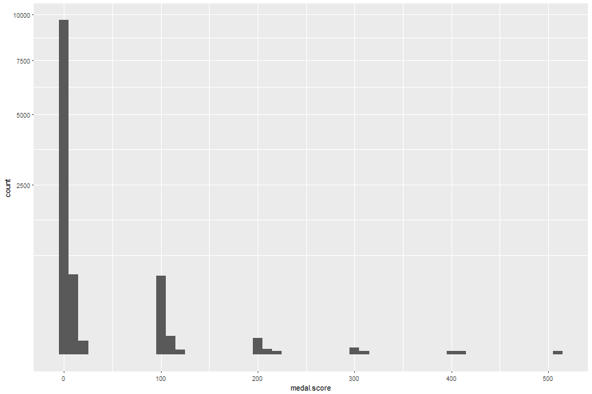

The y-axis scale was transformed to square root since the data is very concentrated at zero, in order to better visualize the count for the other values.  
It is possible to notice that the data is very discrete. The table and the summary below show this characteristic.


```
##    Min. 1st Qu.  Median    Mean 3rd Qu.    Max. 
##   0.000   0.000   0.000   6.621   0.000 510.000
```

```
## 
##    0    1    2   10   11   12   20   21  100  101  102  110  111  112  120 
## 9105  567    7  545   14    1   15    2  513   22    1   23    5    1    1 
##  121  200  201  202  210  211  220  300  310  401  410  510 
##    1   21    1    1    2    1    1    4    1    1    1    1
```

Most athletes got no medals. The data is highly concentrated in zero. A great number of athletes also had scores 1, 10 and 100 which indicates one medal of gold, silver or bronze. All other values have a very low frequency, which indicates that it is very rare to have more than one medal. That will be further investigated.  
The maximum score is 510. That is clearly an outlier and was achieved by Michael Phelps.  

The 99 percentile of the medal.score is calculated below:


```
## 99% 
## 100
```

99% of the athletes have score 100 or below. The ones with a score greater than 100 are less than 1%. Those are the ones with more than one medal where at least one is gold. They have very high performance.

The next plots and summary will show the distribution of the total number of medals.

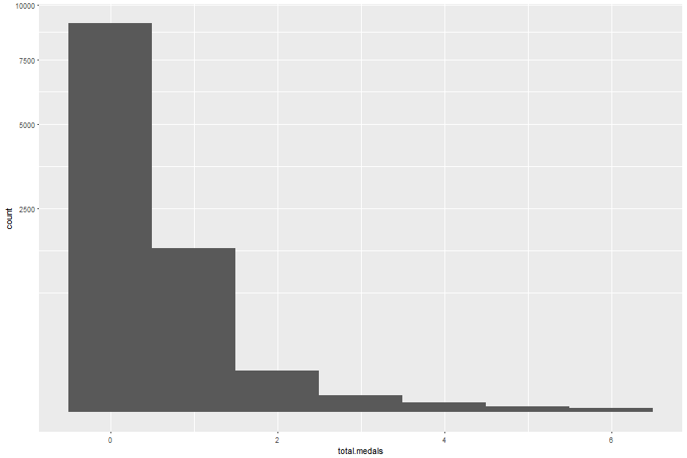

For the total number of medals, the data is also concentrated in the low values.

Summary of the data and table:

```
##    Min. 1st Qu.  Median    Mean 3rd Qu.    Max. 
##  0.0000  0.0000  0.0000  0.1768  0.0000  6.0000
```

```
## 
##    0    1    2    3    4    5    6 
## 9105 1625  102   17    6    2    1
```

This information show how concentrated are the values in zero and one medal. The 99 percentil will be calculated for this variable:


```
## 99% 
##   2
```

99% of the athletes have 2 or less medals. Next it will be calculated the percentil of the ones who won 3 medals.


```
## [1] 0.9991711
```

That is 99.9. The athletes with three or more medals are one in a thousand.  
The type of sport may influence this result, since some of them have different events and the athletes have the chance to compete for more than one medal (e.g. swimming and gymnastics), while in other sports the athletes can win only one medal (e.g. football). It is possible to see this difference in the following plot.

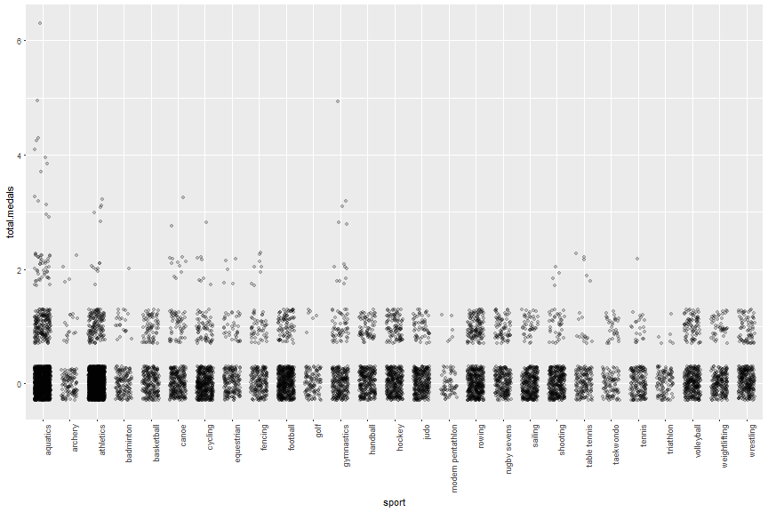

Only the following sports have athletes with two or more medals: tennis, table tennis, shooting, gymnastics, fencing, equestrian, cycling, canoe, badminton, athletics, archery and aquatics. That is less than a half of all sports types. Since not all athletes have the possibility of receiving more than one medal, the medal.score criterion is considered more important than the total of medals in order to evaluate an athletes performance. But the total of medals is also an interesting metric, then it will remain being used in the analysis but carefully.

Since there are very low frequency values for 3, 4, 5 and 6 medals, the variable total.medals will be modified in order to have only three categories: 0, 1 and two or more medals. The category "two or more" will represent the top 1% of the values, which are the athletes with the highest performance.  
A new variable will be created with this modification: total.medals.bucket.


```
##         0         1 2 or more 
##      9105      1625       128
```

In this analysis two criteria were used to evaluate the athletes results: the number of medals and the type of medals. According to the type of medals criterion, the top 1% of the athletes have score equal or higher than 100 (which means at least one gold medal) and according to the number of medals criterion, the top 1% of the athletes have at least two medals of any type. The number of medals must be used carefully and only as a complement to the type of medal criterion since not all athletes had the chance to compete for more than one medal.

In the next sessions, the characteristics of the athletes will be related to these variables in order to understand if some of these characteristics could have helped the athlete reach better results.

### Athletes characteristics

In this analysis the scales will be frequently transformed to log10 or square root because the data is very skewed and concentrated at zero.  

**Sex**  
The first variable of interest to be analyzed will be the athletes sex. The next plot shows frequency polygons for male and female. The frequency of each bin is in percentage and the scale was transformed to log. 

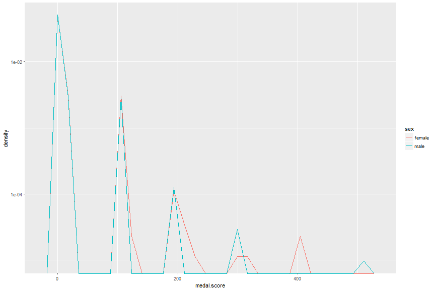

The distribution of women score is very similar to the men but it is a little less concentrated in the peaks. Thay may indicate that in the case of men, there are more different athletes receiving one medal, while for women there are more athletes receiving more than one medal. This difference doesn't seem to be significant in this plot.  
Men an women have nearly equal chances of winning medals, since in most sports they do not compete against each other. There are some differences because there are more men competing and the number of events for each sex is not the same but for this analysis those differences should not have a great influence.  
Number of male and female athletes in the dataframe:  


```
## female   male 
##   4996   5862
```

The objective of the analysis of the variable sex is only to ensure that the distributions do not present great differences.  
One more plot will be made for this variable, where the total number of medals will be compared. The frequency in this case is the percentage of the total of men and women and the y-axis was transformed using squared root.  

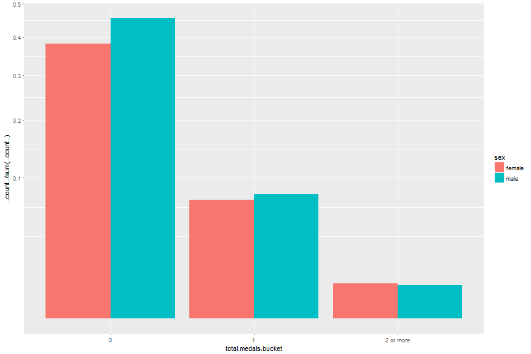

The comments made to the previous plot can be observed in this one. There is a higher percentage of male athletes with one medal and a higher percentage of female athletes with two or more medals. The differences are not remarkable and the analysis will continue considering that the distributions for men and women are very similar and will not influence the analysis of the other characteristics.  

**Country**  

The next characteristic to be analyzed is the nationality of the athletes.   
This feature may influence the training, the investment in the athlete, food habits, cultural habits, among other things.   

Number of unique countries:

```
## [1] 200
```

Number of unique countries with at least one medal:

```
## [1] 82
```

As 200 is a huge number of countries to plot, only the countries with at least one medal will be in the next plot. A new dataframe will be created where countries without any medal are removed.

```
## [1] 82
```

The next plot will show the score and total of medals of the athletes of these countries. Some countries were omitted from the x-label in order to make it readable.

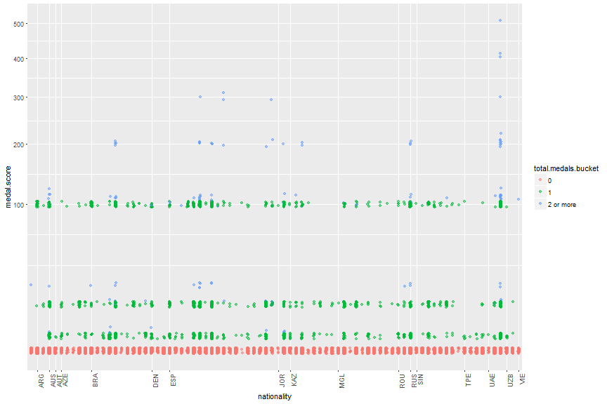

Athletes with score higher than 100 are concentrated in about 15 countries, which are apparently the same countries that have athletes with more than one medal (with some exceptions).  
The green points represent the athletes that won one medal of bronze, silver or gold. These athletes are distributed through all countries, although not all of them have more than one athlete with each medal.  

According to the first analyses, the top 1% of the athletes have score 100 or higher or more than one medal.  
The number of countries with athletes that have score 100 or higher and their names will be displayed below:


```
## [1] 58
```

```
##  [1] USA RUS GBR ARG JOR CHN GER AUS BRA ETH ROU SRB POL GRE NED FIJ HUN
## [18] ARM JAM FRA JPN NZL KOR ESP DEN RSA COL KEN ITA CAN TJK KAZ SUI IOA
## [35] BEL IRI CRO CUB UKR SWE PRK SIN SVK GEO INA CZE KOS PUR AZE UZB BRN
## [52] BAH TPE THA TUR SLO BLR VIE
## 207 Levels: AFG ALB ALG AND ANG ANT ARG ARM ARU ASA AUS AUT AZE BAH ... ZIM
```

The athletes with score 100 or higher belong to 58 different nationalities. That represents 29% of the total of countries that participated in the olympic games. This is a considerable distribution since these athletes are only 1% of the total. That shows the best performance athletes are not concentrated in a few contries.

Next, it will be shown the number of countries and their names for the ones with athletes that received more than one medal.


```
## [1] 27
```

```
##  [1] USA GBR CHN RUS ETH CAN GRE NED FRA KOR AUS RSA HUN JAM GER ITA BRA
## [18] CZE JPN DEN NZL ESP UKR SWE ALG KEN VIE
## 207 Levels: AFG ALB ALG AND ANG ANT ARG ARM ARU ASA AUS AUT AZE BAH ... ZIM
```

Athletes with two or more medals belong to 27 different countries. This number is low considering that 200 countries participated in the olympic games. That represents only 13.5% of all the countries.  
It will be verified if all this countries are in the previous list:


```
## [1] "ALG"
```

Only one country have athletes with more than one medal but none with score 100 of higher: ALG.  

This analysis considered each athletes performance, but it didn't consider that one country could have several athletes with one gold medal, for example.  

A line of average medal.score for each country will be added to the previous plot.

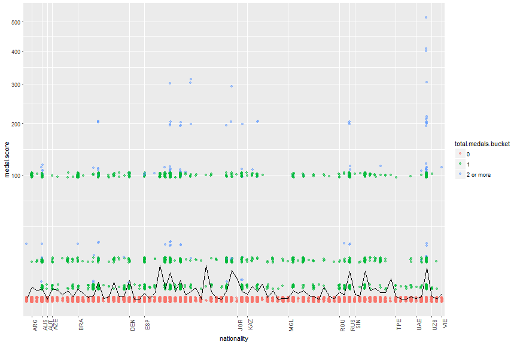

This is an interesting metric, since it shows the average performance of all athletes from the same country. The previous analysis considered the performance of each athlete individually, while this one considers the performance of the group. It is necessary to be carefull with this result since the number of athletes from each country will affect the mean. 

Next, the data will be grouped by nationaly and some summaries calculated.


Besides the mean score, it was also computed the total score for each nationality, the total number of medals and the mean number of medals.

First, it will be verified if some of these countries have less than 10 athletes.


```
## # A tibble: 6 x 6
##   nationality mean_score total_score total_medals mean_medals     n
##        <fctr>      <dbl>       <dbl>        <int>       <dbl> <int>
## 1         IOA  25.250000         101            2   0.5000000     4
## 2         JOR  16.666667         100            1   0.1666667     6
## 3         KOS  12.500000         100            1   0.1250000     8
## 4         TJK  16.666667         100            1   0.1666667     6
## 5         BDI   1.111111          10            1   0.1111111     9
## 6         NIG   1.666667          10            1   0.1666667     6
```

There are 6 nationalities with less than 10 athletes, but their mean_score is not very high, except for IOA. The Individual Olympic Athletes (IOA) may affect the results, since it has four athletes and two medals. 

The data from these summaries can be observed in the plots below.

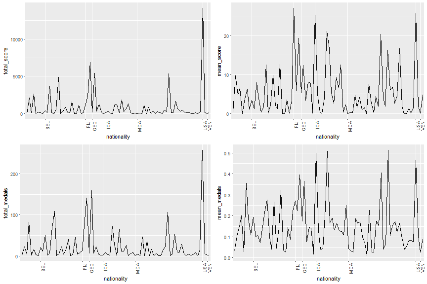

It is possible to notice that the plot of total_medals and total_score have a very similar shape, while mean_score and mean_medals also have a similar shape. The last two will be affected by the number of athletes with each nationality.  
In a general way, the countries with a high number of medals seems to the be the same that have a high score. The peaks are almost in the same places.  
These data will be further analyzed.

The new dataframe was ordered according to the sum of medal.scores (total_score) of the athletes. The countries with highest total scores are shown below:


```
## # A tibble: 6 x 6
##   nationality mean_score total_score total_medals mean_medals     n
##        <fctr>      <dbl>       <dbl>        <int>       <dbl> <int>
## 1         USA  25.706522       14190          258   0.4673913   552
## 2         GBR  19.280899        6864          141   0.3960674   356
## 3         GER  12.427586        5406          159   0.3655172   435
## 4         RUS  20.382576        5381          107   0.4053030   264
## 5         CHN  12.529262        4924          109   0.2773537   393
## 6         BRA   7.909871        3686           50   0.1072961   466
```

These are the countries with most athletes with high scores.  
All this countries appeared in the previous list of countries with athletes that received two or more medals.

Below is the list of the six nationalities with the highest mean scores.


```
## [1] FIJ USA IOA JAM RUS GBR
## 207 Levels: AFG ALB ALG AND ANG ANT ARG ARM ARU ASA AUS AUT AZE BAH ... ZIM
```

The IOA appeared in the list, as expected, but it is difficult to say in its case that the nationality influenced the performance, since there were only four athletes in this group.  
Fiji had a high score because many of their athletes got one medal. That happened because Fiji won only one gold medal but in a team sport: rugby. All the athletes of the team got one medal and that is what appeared in this metric.

Next, the six countries with the highest total of medals:


```
## [1] USA GER GBR CHN RUS FRA
## 207 Levels: AFG ALB ALG AND ANG ANT ARG ARM ARU ASA AUS AUT AZE BAH ... ZIM
```

This list is basically the same of the one with countries with highest total scores. Only FRA is new.  

Next, the six countries with highest mean number of medals. In this case, the number of athletes will also influence the result.


```
## [1] SRB JAM IOA USA RUS GBR
## 207 Levels: AFG ALB ALG AND ANG ANT ARG ARM ARU ASA AUS AUT AZE BAH ... ZIM
```

IOA appeared in this list, as expected, and SRB wasn't in the previous lists. SRB is in a similar situation as Fiji. Two of the medals won by the athletes with this nationality were in team sports and it had a low total number of athletes (103). Because of that, the mean number of medals is very high.  
JAM, USA, RUS and GBR were also in the previous list.

In the analysis of the individual performance of the athletes it was observed that the top performance athletes are distributed in around 30% of the countries, suggesting that the nationality should not affect the athletes results. However the analysis of the performance of the group of athletes from each country showed that most high performance athletes come from a few countries: USA, RUS, GBR, GER, CHN and JAM.  
The conclusion of this analysis is that although high performance athletes may rise from any country, some countries are more likely to have high performance athletes. It seems the nationality influences the athletes performance.

**Age**

In this section it will be analyzed if the age is related with the athletes results.

First a histogram with the distribution of age will be created:

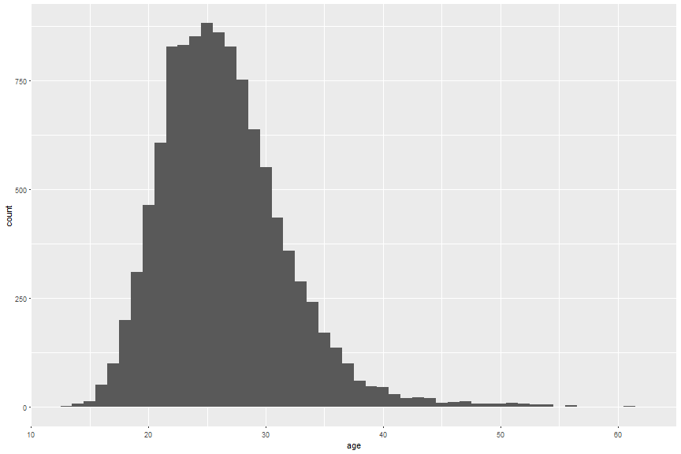

It seems most of the athletes are around 25 years old. Some outliers can be observed, like the one over 60. And there are some very young athletes, under 15.  
Two boxplots will be made in order to verify if the age distribution changes with sex or with sport.

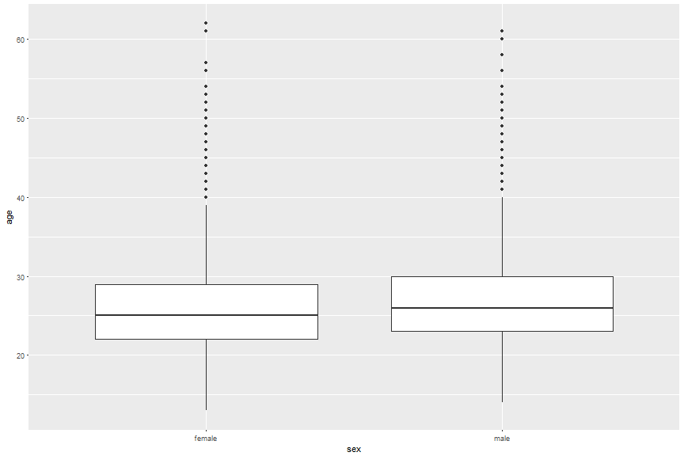

```
## rio_athletes$sex: female
##    Min. 1st Qu.  Median    Mean 3rd Qu.    Max. 
##   13.00   22.00   25.00   25.89   29.00   62.00 
## -------------------------------------------------------- 
## rio_athletes$sex: male
##    Min. 1st Qu.  Median    Mean 3rd Qu.    Max. 
##   14.00   23.00   26.00   26.91   30.00   61.00
```

The plot and summary shows that the men were in average one year older than the women. This difference will not have a great impact in the following analyses.  
The oldest athlete was 62 years old and the youngest 13.  

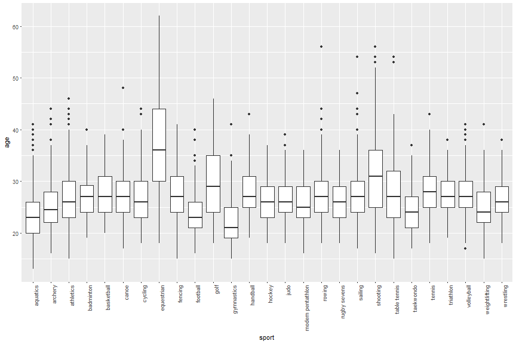

The boxplot of age and sport shows that there are some variations in the distribution of age for each sport. Some cases stand out: the athletes of the sports equestrian, golf and shooting are in average older than the others, while the ones of gymnastics are much younger.   
No deep analysis will be developed from this plot, but this characteristic may influence the next analyses and should be considered.  

Now it will be verified how the athletes performance is related to age. The data will be grouped by age in a new dataframe.


Plots of the the total score and total number of medals for each age will be created: 

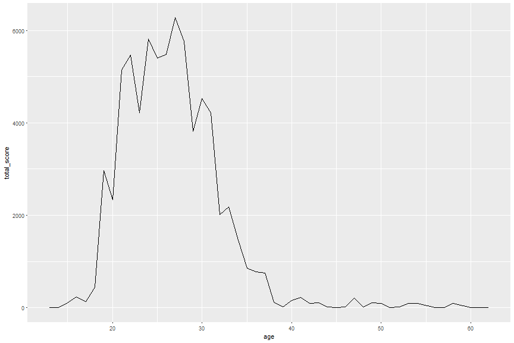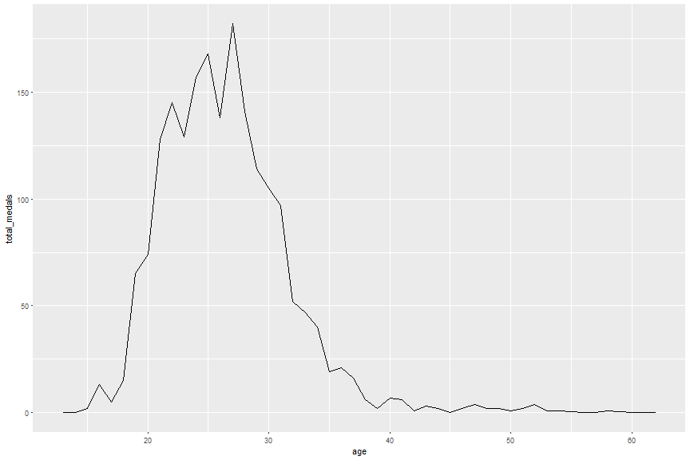

These plots show that the medals are most concentrated with athletes of 20 to 30 years. However, that is the age of the majority of the athletes, there are more individuals in this group. In this way, it makes more sense to calculate the mean score and mean number of medals for each age. That will be shown in the plots below.

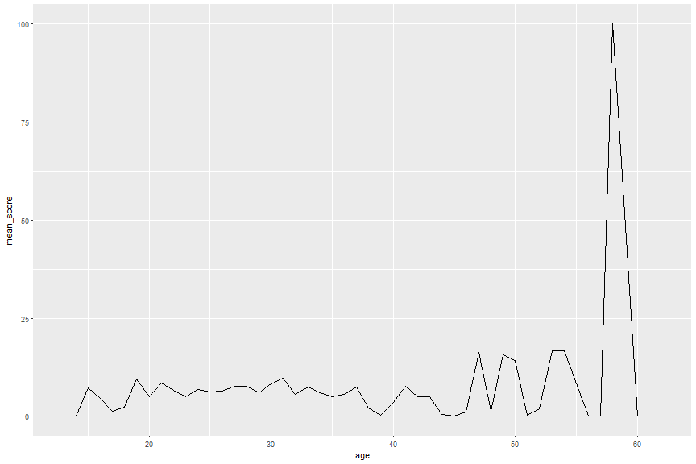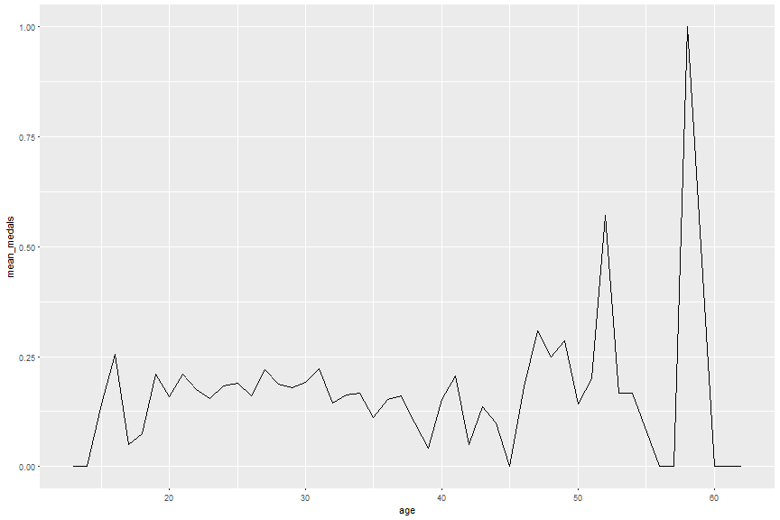

These values are very close to zero because most of the athletes had no medals.  
It seems there is no clear correlation between age the the athletes result.  
It was observed high scores and number of medals for the athletes over 45. That will be examined observing the dataframe.


```
## # A tibble: 15 x 6
##      age total_score total_medals mean_score mean_medals     n
##    <dbl>       <dbl>        <int>      <dbl>       <dbl> <int>
##  1    46          11            2   1.000000   0.1818182    11
##  2    47         211            4  16.230769   0.3076923    13
##  3    48          11            2   1.375000   0.2500000     8
##  4    49         110            2  15.714286   0.2857143     7
##  5    50         100            1  14.285714   0.1428571     7
##  6    51           2            2   0.200000   0.2000000    10
##  7    52          13            4   1.857143   0.5714286     7
##  8    53         100            1  16.666667   0.1666667     6
##  9    54         100            1  16.666667   0.1666667     6
## 10    56           0            0   0.000000   0.0000000     4
## 11    57           0            0   0.000000   0.0000000     1
## 12    58         100            1 100.000000   1.0000000     1
## 13    60           0            0   0.000000   0.0000000     1
## 14    61           0            0   0.000000   0.0000000     2
## 15    62           0            0   0.000000   0.0000000     1
```

In the case of the age 58, there was only one athlete and he got a gold medal. That is why there is a peak at this age.  
In the case of the ages 46 to 54, some athletes in these ages got medals (including gold medal, which makes them the top 1%) but there are only a few athletes in each of these groups. The larger one has 13. Because of that the mean was high for these cases.  

The number of individuals in each group from 20 to 30 years will be shown below:


```
## # A tibble: 11 x 2
##      age     n
##    <dbl> <int>
##  1    20   465
##  2    21   608
##  3    22   829
##  4    23   832
##  5    24   852
##  6    25   882
##  7    26   861
##  8    27   829
##  9    28   753
## 10    29   638
## 11    30   551
```

There is around 800 individuals in each group and most of them got no medals. That is why the mean is lower in these cases.  
It is not possible to affirm that older athletes have better performance since the sample of these athletes is very small.

The older athletes will be removed from the plot of mean score, in order to better visualize the correlation.

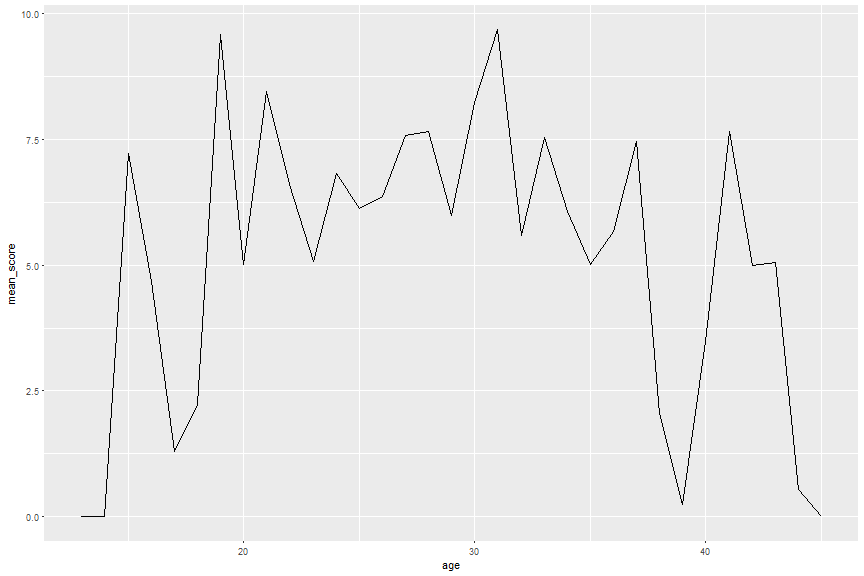

There are two age values with very low mean score (around 17 and 39) but all other score mean values seem very close and there is no trend in the plot. There is no correlation between age and an athletes performance.

One more plot will be made regarding this topic. The previous investigation evaluated the age of the athletes in a general way. This time it will be verified if the age of the best athletes varies with the sports.  
In order to do this investigation, one new variable will be created that separates the athletes in three groups:  
 - The top 1% athletes (TOP1): the ones with score 100 or higher.  
 - The medium performance athletes (MED): the ones that won medals but the score is less than 100.  
 - The bad performance ones (BAD): no medals.  
 
 The new variable will be called performance.
 

```
##          id           name nationality    sex      dob height weight
## 1 736041664 A Jesus Garcia         ESP   male 10/17/69   1.72     64
## 2 532037425     A Lam Shin         KOR female  9/23/86   1.68     56
## 3 435962603    Aaron Brown         CAN   male  5/27/92   1.98     79
## 4 521041435     Aaron Cook         MDA   male   1/2/91   1.83     80
## 5  33922579     Aaron Gate         NZL   male 11/26/90   1.81     71
## 6 173071782    Aaron Royle         AUS   male  1/26/90   1.80     67
##       sport gold silver bronze total.medals age medal.score
## 1 athletics    0      0      0            0  46           0
## 2   fencing    0      0      0            0  29           0
## 3 athletics    0      0      1            1  24           1
## 4 taekwondo    0      0      0            0  25           0
## 5   cycling    0      0      0            0  25           0
## 6 triathlon    0      0      0            0  26           0
##   total.medals.bucket performance
## 1                   0         BAD
## 2                   0         BAD
## 3                   1         MED
## 4                   0         BAD
## 5                   0         BAD
## 6                   0         BAD
```

The next plot shows the athletes age for each sport, colored by performance. The black line indicates the mean age of all athletes for each sport.

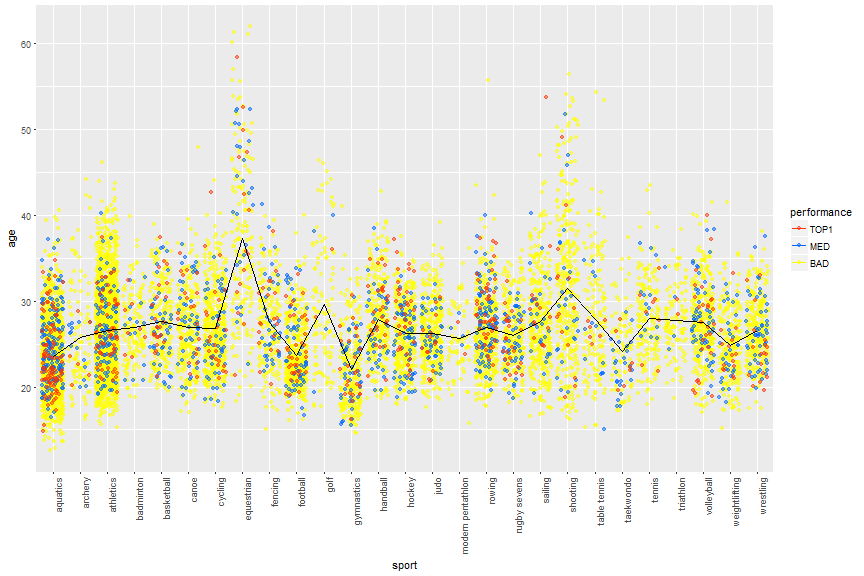

This visualization shows that there is no pattern regarding age, performance and sports.  
The athletes over 45 years old with medals that appeared in the previous plots were from the sports that have in average older athletes (equestrian and shooting).   
Most top 1% athletes for some sports seems to be older than the average that competed (like handball and tennis). In the case of other sports, they are in general younger than the average (football, taekwondo and weghtlifiting). However in most cases the top 1% of the athletes are spread in all the age range.  
This investigation concluded that there is no clear correlation between age and the athletes results.

**Height**

This and the next section will evaluate how height and weight are correlated with the athletes results in the Olympic Games. Men and women will be analyzed separatelly in these cases since they have different physical characteristics. The result may be different for each sport, in this way this variable must also be taken into consideration.

First, histograms of height will be created.

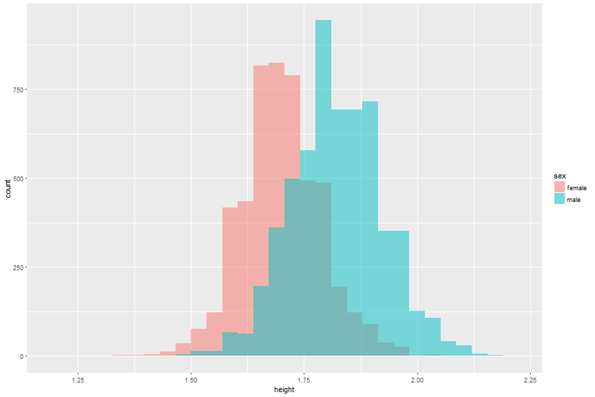

It is clear that men are taller than women. The following summary will show this difference:


```
## rio_athletes$sex: female
##    Min. 1st Qu.  Median    Mean 3rd Qu.    Max. 
##    1.21    1.64    1.70    1.70    1.75    2.03 
## -------------------------------------------------------- 
## rio_athletes$sex: male
##    Min. 1st Qu.  Median    Mean 3rd Qu.    Max. 
##   1.450   1.760   1.820   1.824   1.890   2.210
```

In average, men are around 10cm taller than women.  
Most women have height between 1.64 and 1.70m and men have between 1.76 and 1.89m.   

These two cases must be analyzed separately.  

Now, it will be observed if there are differences in height for each sport.

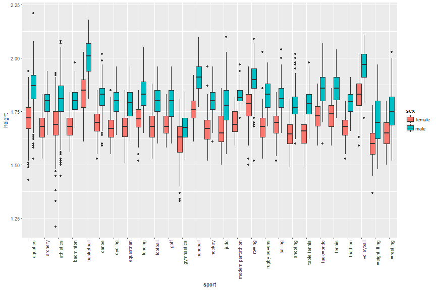

There are some differences in the height distribution according to the sport. It is possible to observe that female and male follow similar patterns.  
Basketball and volleyball are the sports with taller athletes for both sexes, followed by handball and rowing.  
The sports with shorter athletes are gymnastics and weightlifting.

An analysis similar to the one done for age will be executed.


In order to join the men and women data in the same analysis (and make the plots simpler) the values of height will be standardized for each sex. The mean height will be used for that. All women height will be divided by 1.70 and all men height by 1.824.


Checking if the new dataframe was properly created:


```
## # A tibble: 6 x 9
##      sex    sport height total_score total_medals mean_score mean_medals
##   <fctr>   <fctr>  <dbl>       <dbl>        <int>      <dbl>       <dbl>
## 1   male aquatics   1.91        1034           17   36.92857   0.6071429
## 2 female aquatics   1.73         844           16   19.62791   0.3720930
## 3   male aquatics   1.94         831           12   25.96875   0.3750000
## 4 female aquatics   1.83         712           10   44.50000   0.6250000
## 5 female aquatics   1.76         655           16   18.71429   0.4571429
## 6 female aquatics   1.86         643           13   71.44444   1.4444444
## # ... with 2 more variables: n <int>, height.std <dbl>
```

This time the plots of total score and total medals will not be made, since it was already observed that these metrics are not interesting.  

Plots of the the mean score will be created: 

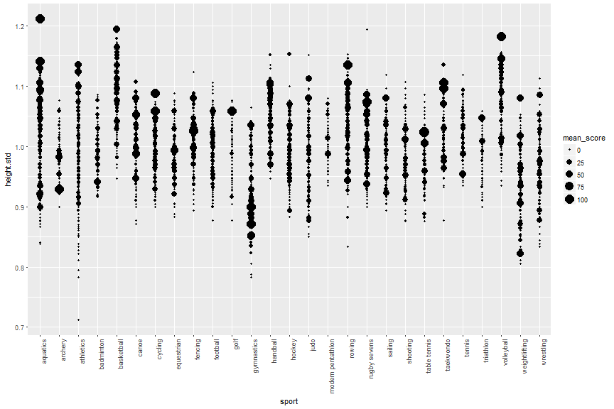

Some mean score with value 100 appeared in the plot. That may indicate several people with a gold medal, but it probably indicates that there is a very small group, maybe only one person with that height.  
Checking if there are groups smaller then 5 in the dataframe:


```
## [1] 963
```

There are 963 very small groups that are probably affecting the results.  

The grouped dataframe will be rebuilt without grouping by sport. Althought this is an important variable, the investigation of the mean score must be general for all sports.


Checking the head of the dataframe:


```
## # A tibble: 6 x 6
##   height.std total_score total_medals mean_score mean_medals     n
##        <dbl>       <dbl>        <int>      <dbl>       <dbl> <int>
## 1  1.1823529         100            1  100.00000   1.0000000     1
## 2  1.2116228         100            1  100.00000   1.0000000     1
## 3  0.8529412         402            6   44.66667   0.6666667     9
## 4  0.8223684         100            1   33.33333   0.3333333     3
## 5  1.1647059         100            1   33.33333   0.3333333     3
## 6  1.1941176         100            1   33.33333   0.3333333     3
```

Now the mean score can be evaluated.

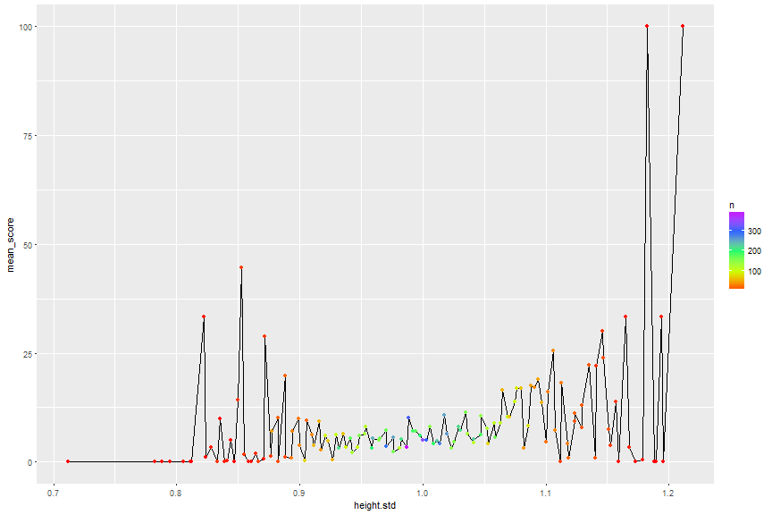

The previous plot shows the variation of the mean score with the standardized height. The value 1 means a height equals to the average.  
The colored points indicate the number of individuals in each group. That may affect the mean, as observed before.  
In the extremes it is possible to notice that there is only a few individuals and the mean is very high. These points are marked in red and the result must not be considered in the analysis since the sample is very small. However it shows that there are people from all the range of heights winning medals.  

The same plot will be created for the mean number of medals.

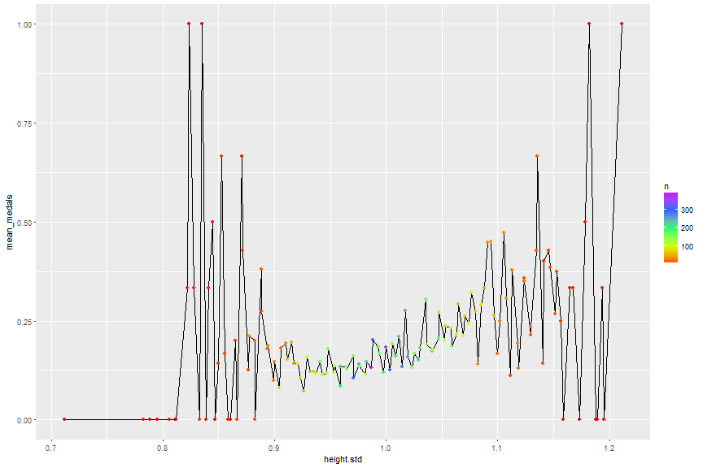

A very similar behavior as the previous plot could be observed.  

Despite the peaks in the extremes, it is possible to see a trend in the values around the height 1. It seems the mean score and mean number of medals increase with height. These plots will be rebuilt removing groups with 10 or less individuals.

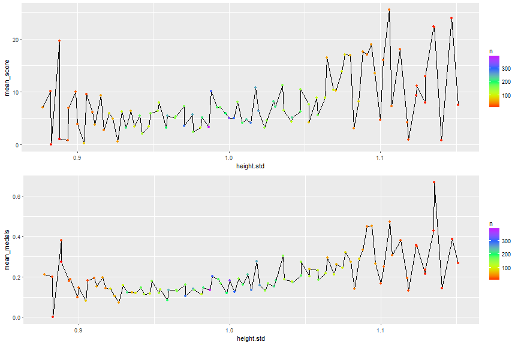

It seems there is a linear trend. Pearson correlation coefficient will be calculated and tested.


```
## 
## 	Pearson's product-moment correlation
## 
## data:  height.groups_over_10$height.std and height.groups_over_10$mean_score
## t = 5.3898, df = 92, p-value = 5.409e-07
## alternative hypothesis: true correlation is not equal to 0
## 95 percent confidence interval:
##  0.3189167 0.6299666
## sample estimates:
##       cor 
## 0.4898787
```

The Pearson correlation coefficient is 0.4898787.  
According to the two-tailed hypothesis test, the p-value is 5.409e-07 which means it is statistically significant. There is a correlation between the athletes height and mean medal score. Taller athletes are more likely to have a better performance in general for all sports.  
The true correlation 95% Confidence Interval is (0.3189167, 0.6299666).  

This same test will be done with the mean number of medals.


```
## 
## 	Pearson's product-moment correlation
## 
## data:  height.groups_over_10$height.std and height.groups_over_10$mean_medals
## t = 6.8319, df = 92, p-value = 8.89e-10
## alternative hypothesis: true correlation is not equal to 0
## 95 percent confidence interval:
##  0.4278292 0.7004363
## sample estimates:
##       cor 
## 0.5801552
```

The correlation is even stronger than in the case of the mean score. The Pearson correlation coefficient is 0.5801552. The hypothesis test also indicated that this correlation is statistically significant.

This correlation may vary from one sport to another. Next the correlation will be calculated for each sport. First the data will be transformed.


```
## # A tibble: 6 x 32
##   height.std total_score total_medals mean_medals     n aquatics archery
##        <dbl>       <dbl>        <int>       <dbl> <int>    <dbl>   <dbl>
## 1  0.8529412         401            5   0.8333333     6       NA      NA
## 2  0.8717105         101            2   0.5000000     4       NA      NA
## 3  0.8771930           0            0   0.0000000    10       NA      NA
## 4  0.8771930           1            1   0.1000000    10       NA      NA
## 5  0.8771930         101            2   0.3333333     6       NA      NA
## 6  0.8771930         101            2   0.5000000     4       NA      NA
## # ... with 25 more variables: athletics <dbl>, badminton <dbl>,
## #   basketball <dbl>, canoe <dbl>, cycling <dbl>, equestrian <dbl>,
## #   fencing <dbl>, football <dbl>, golf <dbl>, gymnastics <dbl>,
## #   handball <dbl>, hockey <dbl>, judo <dbl>, `modern pentathlon` <dbl>,
## #   rowing <dbl>, `rugby sevens` <dbl>, sailing <dbl>, shooting <dbl>,
## #   `table tennis` <dbl>, taekwondo <dbl>, tennis <dbl>, triathlon <dbl>,
## #   volleyball <dbl>, weightlifting <dbl>, wrestling <dbl>
```

In this new dataframe, the groups tend to be smaller, then groups with more than 3 athletes were accepted.   
Now the correlation for each case will be calculated:


```
##             aquatics    archery athletics badminton basketball    canoe
## height.std 0.3367801 -0.1170452 0.2150874  0.193489  0.1102876 0.316881
##               cycling equestrian   fencing  football       golf gymnastics
## height.std 0.08360877 0.01661776 0.1037087 0.1617522 0.06024556 -0.4397631
##             handball     hockey       judo modern pentathlon    rowing
## height.std 0.3106578 -0.2073469 -0.2224205         0.7870743 0.2905238
##            rugby sevens  sailing   shooting table tennis taekwondo
## height.std    0.2102121 0.283831 0.02927248   -0.1591313  0.163724
##                 tennis  triathlon volleyball weightlifting   wrestling
## height.std -0.03525421 -0.1187297  0.1104187   0.003525365 -0.02994956
```

Hypothesis tests were not made in this cases, but it is possible to observe that for some sports it seems there is no correlation between height and the mean medal score (e.g. cycling, equestrian, golf, shooting, tennis, weightlifting and wrestling). In all these cases, the Pearson correlation coefficient is very low.  
In the other hand, some sports presented very strong correlation between height and mean score: aquatics, canoe, gymnastics, handball and modern pentathlon.  
And some of them presented a negative correlation, which means the shorter athletes are more likely to win medals: archery, gymnastics, hockey, judo, and table tennis.  

The investigation of height showed that there is a correlation between height and the athletes performance. In a general way, taller athletes have a better performance, but that may change from one sport to another.

Before moving to the analysis of weight, there is one more investigation to be done. Maybe the countries that concentrate most athletes with high performance are also the ones with taller athletes. If that is the case, the correlation between height and mean score could be caused by the nationality of the athletes and not by the height itself. That will be investigated next.  

The data will be grouped by nationality and the mean and median height will be calculated. The 15 countries with higher mean standardized height will be shown:


```
## # A tibble: 15 x 1
##    nationality
##         <fctr>
##  1         SRB
##  2         SUR
##  3         CRO
##  4         ISL
##  5         SYR
##  6         MNE
##  7         LTU
##  8         LIE
##  9         BIZ
## 10         SEN
## 11         CMR
## 12         NED
## 13         DEN
## 14         PUR
## 15         POL
```

During the nationality investigation, it was observed that the following countries concentrate athletes with high performance: USA, RUS, GBR, GER, CHN and JAM. None of them is in the list of the countries with the tallest athletes.  
In this way, it is possible to conclude that the nationality and height are both related to the athlete performance in different ways. One is not influencing the other (at least not in a relevant way).

**Weight**

The same analysis made for height will be repeated for weight. As the athletes height influences weight there is a great chance that this variable is also correlated with the athletes performance.

First, the histograms and summaries for each sex will be created.

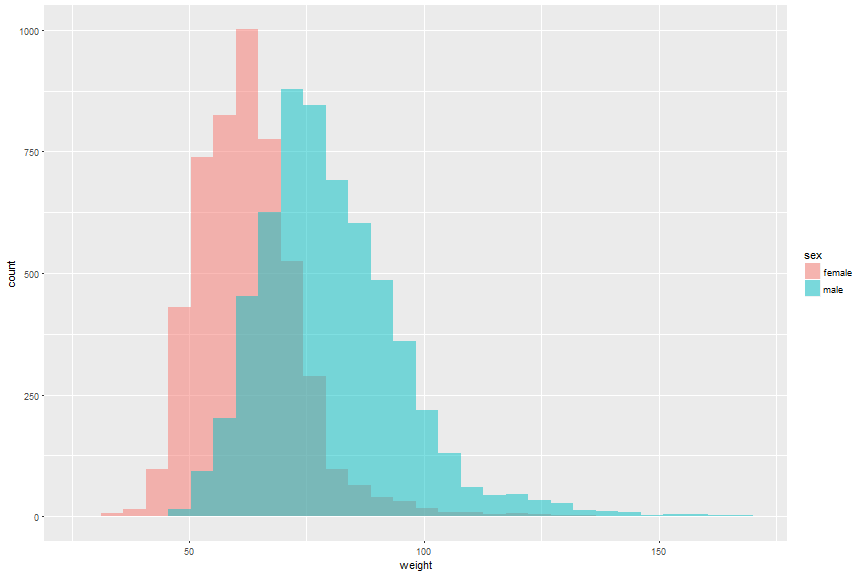

```
## rio_athletes$sex: female
##    Min. 1st Qu.  Median    Mean 3rd Qu.    Max. 
##   31.00   55.00   61.00   62.63   68.00  150.00 
## -------------------------------------------------------- 
## rio_athletes$sex: male
##    Min. 1st Qu.  Median    Mean 3rd Qu.    Max. 
##   39.00   70.00   78.00   80.12   88.00  170.00
```

The differences between mean and women weight distribution are much higher than the differences in height. 

Next, it will be observed the differences for each sport.

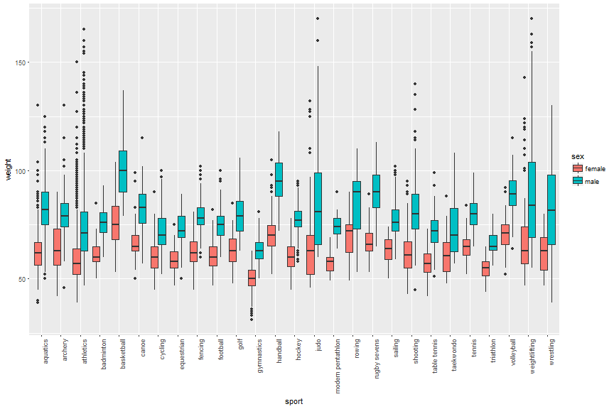

The sports with highest median weights are basketball, handball, volleyball, rugby and rowing for both men and women. The ones with lowest meadian weights are gymnastics and triathlon.  
There are a lot more outliers than in the case of height, specially for athletics.    

Some sports events are based on the athletes weight: boxing, judo, taekwondo and weightlifting. In this cases, there will be winners for each weight range. Maybe there is some correlation between weight and performance within each range, but this dataset do not provide the information of which athlete competed in which event. In this way, these sports will be removed from this analysis. 

In this analysis, the weight data for men and women will also be standardized by the mean. All women weight will be divided by 62.63 and all men height by 80.12.

Initially the analysis will be global for all sports.


```
## # A tibble: 6 x 6
##   weight.std total_score total_medals mean_score mean_medals     n
##        <dbl>       <dbl>        <int>      <dbl>       <dbl> <int>
## 1  1.5351972         100            1  100.00000   1.0000000     1
## 2  2.1714833         100            1  100.00000   1.0000000     1
## 3  1.6605461         100            1   33.33333   0.3333333     3
## 4  1.2933099         412            7   31.69231   0.5384615    13
## 5  0.6365452         111            3   27.75000   0.7500000     4
## 6  1.4050774         200            2   25.00000   0.2500000     8
```

The new dataframe was properly created.  
The mean score and mean number of medals will be plotted against the standardized weight.

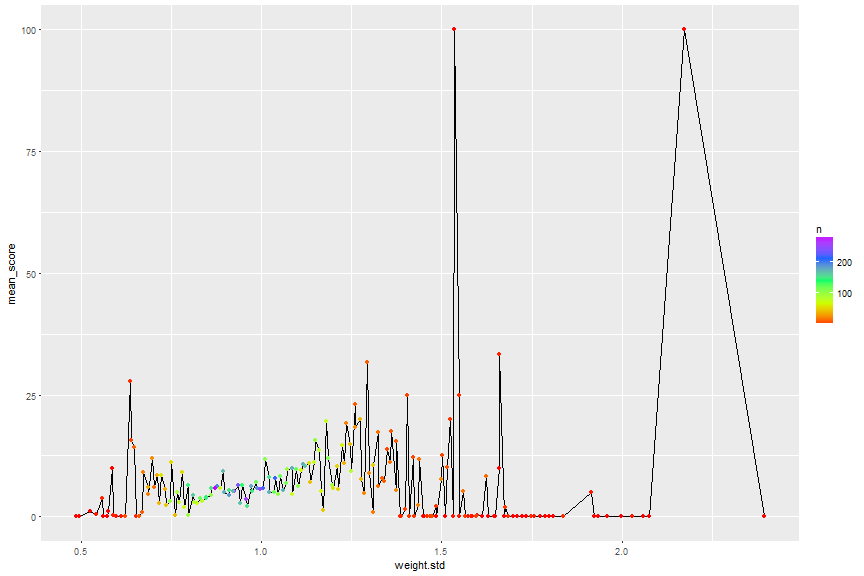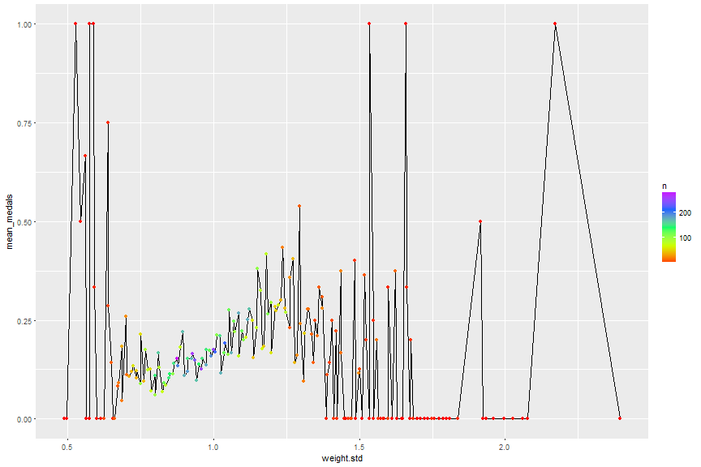

The color in the plots represent the number of individuals in each group.
The same way that occurred with the height plots, there are some peaks in the extremes probably because of groups with a very small number of individuals. In the next plots, groups with 10 or less athletes will be removed in a way that it is possible to observe the trend in the middle of the plots.   

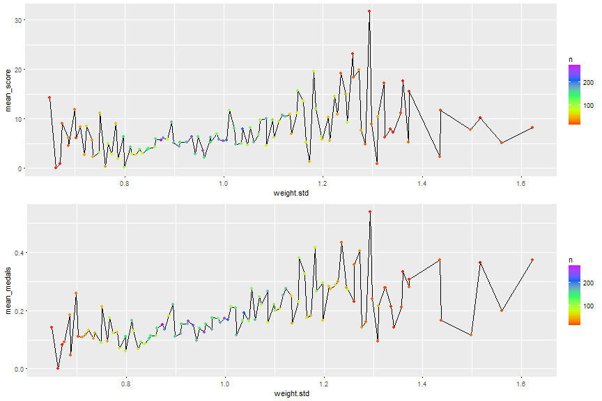

It seems there is some correlation between the athletes result and the weight. It is not possible to determine with this data if this trend is caused by the athletes height or if the weight itself also influences the athletes performance. In order to come to a conclusion about what is causing the athletes with higher height and weight to have a better performance, some experimental test should be made. For now, it is possible to affirm only that there is a correlation between these variables and the athletes result and it is possible to investigate if athletes with the same height and different weights have different results. That will be done later in this report.  

First, the Pearson correlation coefficient for the mean score will be calculated and tested.


```
## 
## 	Pearson's product-moment correlation
## 
## data:  weight.groups_over_10$weight.std and weight.groups_over_10$mean_score
## t = 4.9053, df = 107, p-value = 3.35e-06
## alternative hypothesis: true correlation is not equal to 0
## 95 percent confidence interval:
##  0.2614486 0.5705917
## sample estimates:
##       cor 
## 0.4284782
```

The Pearson correlation coefficient is 0.4284782. The correlation is strong. The two tailed hypothesis test returned p-value 3.35e-06 which means it is statistically significant. There is a correlation between the two variables. The higher the weight, more likely is the athlete to have a better performance. The 95% Confidence Interval for the true correlation coefficient is (0.2614486, 0.5705917).  

Next the correlation coefficient will be calculated for the relation between weight and mean number of medals.


```
## 
## 	Pearson's product-moment correlation
## 
## data:  weight.groups_over_10$weight.std and weight.groups_over_10$mean_medals
## t = 8.9017, df = 107, p-value = 1.548e-14
## alternative hypothesis: true correlation is not equal to 0
## 95 percent confidence interval:
##  0.5290970 0.7485405
## sample estimates:
##       cor 
## 0.6522811
```

The test showed there is a correlation between these variables and the Pearson correlation coefficient is 0.6522811.

The correlation will also be calculated for each sport, as done before with height. The data will be transformed one more time.


```
## # A tibble: 6 x 29
##   weight.std total_score total_medals mean_medals     n aquatics archery
##        <dbl>       <dbl>        <int>       <dbl> <int>    <dbl>   <dbl>
## 1  0.6240639           0            0       0.000     5       NA      NA
## 2  0.6386716         110            2       0.500     4       NA      NA
## 3  0.6490265           0            0       0.000    10       NA      NA
## 4  0.6615077           0            0       0.000    11       NA      NA
## 5  0.6706051          10            1       0.125     8       NA      NA
## 6  0.6739890           0            0       0.000    16       NA      NA
## # ... with 22 more variables: athletics <dbl>, badminton <dbl>,
## #   basketball <dbl>, canoe <dbl>, cycling <dbl>, equestrian <dbl>,
## #   fencing <dbl>, football <dbl>, golf <dbl>, gymnastics <dbl>,
## #   handball <dbl>, hockey <dbl>, `modern pentathlon` <dbl>, rowing <dbl>,
## #   `rugby sevens` <dbl>, sailing <dbl>, shooting <dbl>, `table
## #   tennis` <dbl>, tennis <dbl>, triathlon <dbl>, volleyball <dbl>,
## #   wrestling <dbl>
```

Groups with 3 or less athletes were excluded.   
The correlation for each case will be calculated:


```
##             aquatics   archery athletics   badminton basketball      canoe
## weight.std 0.1679355 0.1454133 0.1551063 0.007431719  0.2145111 0.04485911
##             cycling equestrian    fencing   football       golf gymnastics
## weight.std 0.352675 -0.0453461 0.08562558 -0.1645116 -0.1412031 -0.3516592
##               handball    hockey modern pentathlon    rowing rugby sevens
## weight.std -0.05368496 0.2726669         0.6338791 0.2282297    0.2042557
##                sailing   shooting table tennis    tennis triathlon
## weight.std -0.08817803 0.04673136   0.05377547 0.1488177 0.3782198
##            volleyball wrestling
## weight.std  0.1196348 0.1068631
```

The sports with very weak correlation coefficient are badminton, canoe, equestrian, fencing, handball, sailing, shooting and table tennis. The correlation test was not executed, but for these cases probably it would fail to reject the null hypothesis. It seems there is no correlation.  
The sports with no correlation between weight and mean score are not all the same that have no correlation between height and mean score. That shows it is not only the height that is influencing this relationship.  

The sports with the strongest correlations are cycling, gymnastics, modern pentathlon and triathlon. Gymnastics has a negative correlation, as well as football and golf.

The same way as occurred to the investigation about height, the analysis showed a positive correlation between weight and the athlete performance but that may change according to the specific sport. In a general way, heavier athletes are more likely to have a better performance.

In order to finish this investigation, it will be verified the relation between height, weight and the athletes score.

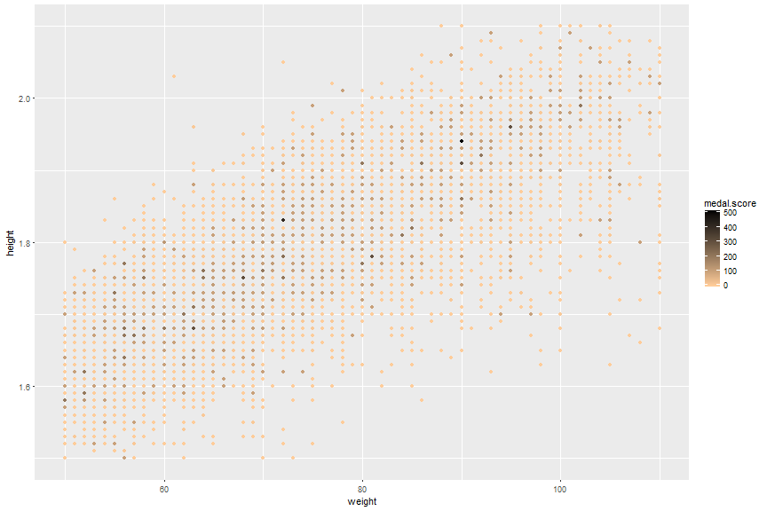

Height and weight are naturally related.  
The x and y axis were limited in order to have a better visualization of the center of the distribution. Some data in the extremes were omitted in this process.  
The objective of the analysis of this plot was to verify if for athletes with the same height, the ones with higher weight have better performance and if for athletes with the same weight, the ones with higher height have better performance. If one of these cases were true, the red points would be concentrated in the top or the botton of the trend. However none of these cases were observed in the plot. The scores are very spread and the highest scores are concentrated in the middle of the trend.  


## Final Plots and Summary

In this section all the investigation results will be presented and three of the most interesting plots will be shown. First all the changes made to the original dataset will be reviwed. 

**Changes made to the data**

The dataset with information about the athletes of Rio 2016 Olympic Games had originally the following variables:

"id", "name", "nationality", "sex", "dob", "height", "weight", "sport", gold", "silver", "bronze"

The first modification made to the dataframe was to remove all rows that had missing values, since most of the cases were in the columns height and weight, that are very important variables for this investigation.  

Some new variables were created during the analysis:  

 + The date of birth (dob) was used to create the variable age. The age was calculated in years from the day the pearson was born until a reference date, which was the first day of the Olimpyc Games: 08/05/2016.  
 + The variable total.medals was a sum of all the medals the athlete won, independently of the type of the medal.   
 + The frequency values for 3, 4, 5 and 6 medals for the variable total.medals were very low compared to the cases 0, 1 and 2. In this way, the variable total.medals.bucket was created in order to have only three categories: 0, 1 and two or more medals. The level "two or more" represented the top 1% of the athletes, which are the ones with the highest performance.  
 + The variable medal.score was one value that reflected how many medals of each type the athlete won. For each gold medal, the athlete received 100 points, for each silver 10 points, and for the bronze medals 1 point.  
 + In order to simplify some plots the variable performance was created based on the medal.score. This variable separated the athletes in three groups:  
 TOP1 represented the top 1% athletes with the best results. The ones with score 100 or higher.  
 MED represented the medium performance athletes, the ones that had at least one medal but none was gold.  
 BAD represented the athletes that got no medals.  
 
Besides the new variables, some modifications were made to the data during the analysis. The dataframe was grouped by different variables, transformed to a wide format, arranged based on a variable and conditional summaries were calculated. All these transformations were described in this report. In all the cases the original dataframe was preserved and new dataframes were created, with an exception when the original dataframe rio_athletes was arranged based on the medal.score.

**Statistical tests**

Statisticall tests were executed in order to define the correlation between the mean medal score and the variables height and weight. These tests considered the following assumptions:

 - The variables are independent.
 - The population is normally distributed.

The tests executed are described below:  

1. The athletes height and the mean medal score are positively correlated, r(92) = .49,  p < .01.  
2. The athletes height and the mean number of medals are positively correlated, r(92) = .58,  p < .01.  
3. The athletes weight and the mean medal score are positively correlated, r(107) = .43,  p < .01. 
4. The athletes weight and the mean number of medals are positively correlated, r(107) = .65,  p < .01. 

**Final Plots**

Three importante plots created during the analysis will be reviewed in this section. 

The first one is a plot created during the investigation of the criteria that would be used to evaluate the athletes performance. Two criteria were used: the medal score and the total number of medals.   
According to the medal score criterion, athletes with score 100 or higher represent 1% of the total of athletes that competed and are the ones with the best performance. Those are the athletes with at least one gold medal.   
According to the total number of medals criterion, the 1% of the athletes with better performance would be the ones with two or more medals of any type.  

The investigation showed that the total number of medals criterion is not fare since some sports do not allow the athletes to compete for more than one medal.

The next plot shows the number of medals of each athlete separated by sport.  
Colors were added to the original plot. They indicate the performance of the athlete. This way it is easier to compare the two criteria.

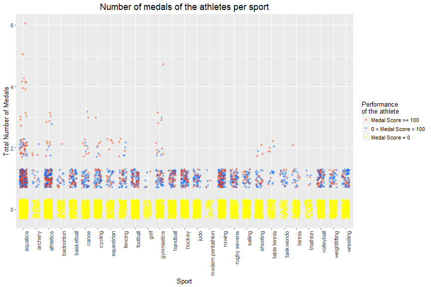

This plot shows that only a few sports have athletes with more than one medal. In most of them, the athletes got one or zero medals.  
The athletes marked in red are the ones considered top 1% according to the medal score criterion. There are athletes with 2 and 3 medals that do not have score 100 or above. The same way, many athletes have only one medal and have score 100. These two cases show athletes that are considered top 1% according to one criterion but not according to the other.  

The medal score criterion was defined as the main criterion to evaluate performance since it is valid for all sports.

The second plot that will be reviewed shows the correlation between the athletes height and the performance.

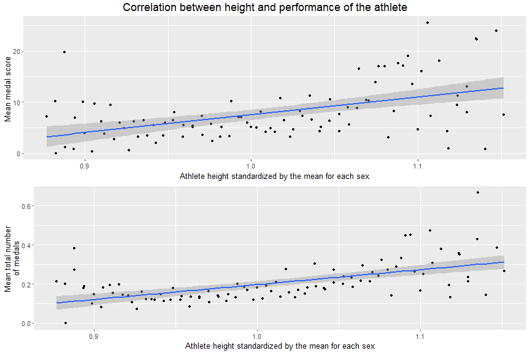

This plot uses the standardized height in order to include men and women in the same plot. For each value of athlete height, it was plot the mean medal score (above) and mean total number of medals (below).  
The original plot was colored in order to indicate the number of individuals in each group of height but this is not necessary anymore, since groups with 10 or less individuals were removed from the plot and it is being considered that all other groups have valid values and a sufficient size for the sample.  
A line of best fit was added to the plot. In this way, the trend is clear between the variables.  

The same plot was made for weight and it also showed a trend.  

It is important to mention that during the analyses it was observed that in spite of the correlation found between the athlete performance and height and weight, that may vary with the sport. Some sports presented a negative correlation between these variables and some presented none.

The last plot will show one important finding: that there is no relation between age and the athlete performance. One could believe that older athletes could have a better chance to win medals since they have more experience and more years of training. Or instead one could think that younger athletes could have more chances since their physical conditions are supposed to be better.  

The investigation of this dataset reached the conclusion that the age does not affect the athletes performance and that can be observed in the plot below.

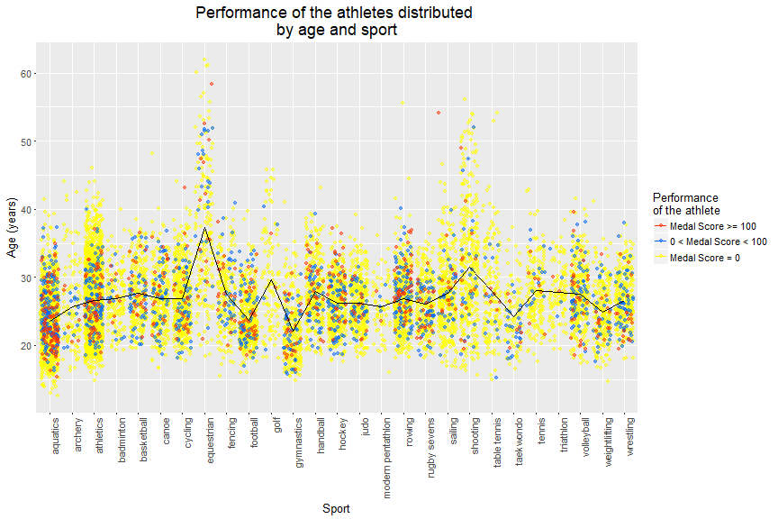

This plot shows that the best athletes of each sport are spread through all the range of ages, with only a few exceptions.

The variable nationality was also analyzed and compared to the athletes performance. It was observed that the top 1% athletes come from 29% of the countries but most of them are concentrated in only a few countries: USA, RUS, GBR, GER, CHN and JAM. That shows that the nationality also may influence the athlete results.


## Reflection

This work objective was to understand if some characteristics of the athletes could make one more likely to have a better performance than another.  
The first step was to define how the performance of the athlete would be measured. Two criteria were used, the medal score (that represents the type of medals) as the main criterion and the total number of medals as secondary.   

Once the criteria were defined, the analysis could start. The following variables were related to the performance: nationality, age, height and weight.  
One difficulty found during the analysis was that the relationship between these variables and the performance depends on the sport. The characteristic of the relationship varies with the sport. Because of that the investigation was made in a general way for all athletes but at some moment it was also compared how it differs from one sport to another.  

One difficulty found regarding the development of the plots was that the most important variable, the medal score, is very discrete and highly concentrated at zero. That made very hard to create good visualizations of this data. In some cases the axes scales had to be adjusted using square root or log.  
The athletes with zero medals could not be excluded from the plots and analyses because it matters to the investigation which are their characteristics, in order to compare with the best athletes.  
Another problem was that the variable nationality has 200 different levels. It was also hard to build usefull and clear plots in this case.  

This Exploratory Data Analysis could verify that the height and weight of the athletes are correlated with the performance, while the age is not correlated, which was the greatest surprise of the analysis, once it was expected that the age would influence the performance. It was also observed that the nationality of the athlete seems to have an influence in his results, although no statisticall test was executed in this case.  

It was also verified if the variables that are related to the performance are related to each other.  
The height and weight are clearly correlated, since a person height affects the weight, but the investigation showed that the correlation between height and performance and weight and performance have different characteristics, despite having some similarities. That shows that there are other factors related to weight that may influence the correlation besides the height. In this way, these two variables and the correlations with the performance were treated as different effects.  
It was also verified if the fact that taller athletes usually have a better result is related with their nationality. The countries with higher mean height were listed and compared with the countries that concentrate most of the high performance athletes. However this comparison showed that they are not the same countries. The correlation between height and medal score seems not to be influenced by the nationality.

There are more analyses that could be explored related to this data. Some suggestions are listed below:

 - The correlation analyses and tests could be made separatelly for each sport.  
 - It could be investigated how the best athletes differ from the others with the same nationality. In the case of countries with a high number of athletes.  
 - A model could be built to predict an athlete performance based on his characteristics.  
 - Future works could involve the association of this dataset with two others dataset about the events and countries that are available to download at the same link.  
 
There are many other variables and characteristics of the athletes that influences the performance and are not available in this dataset. This analysis was limited to the available data and only considered a few aspects of the athlete. All the reasons that would cause the athlete to be more likely to have a better result are very complex and they are widely studied and considered in the professional athletes training.

The variables investigated, specially nationality and height, are usually not changeable for a person. However the analysis also showed that although there are some correlations and patterns, the top 1% athletes can come from any country and have very diverse characteristics. The most valuable conclusion drawn from this investigation is that these are not the most important variables that will define the results of the athlete. Hopefully the most important variables are changeable and depends on the athlete, but there is no data available in this dataset in order to investigate this.


## References

This section lists all the references used in this project:  

Dataset:  
- https://www.kaggle.com/rio2016/olympic-games  

Articles about influences over athletes performance:  
- http://healthyliving.azcentral.com/list-factors-influencing-athletic-performance-4356.html  
- http://digitalcommons.liberty.edu/cgi/viewcontent.cgi?article=1362&context=honors  
- http://watchfit.com/exercise/factors-affect-athletic-performance/  
- http://www.eis2win.co.uk/expertise/performance-analysis/  
- http://www.sportni.net/performance/sports-institute-northern-ireland/performance-science/performance-analysis/  

Olympics:  
- https://www.olympic.org/rio-2016  
- https://en.wikipedia.org/wiki/Women_at_the_Olympics  
- https://en.wikipedia.org/wiki/International_Olympic_Committee_and_gender_equality_in_sports#cite_note-oc-tv.org-13  
- http://www.bbc.com/sport/olympics/rio-2016/medals/countries  
- https://en.wikipedia.org/wiki/Olympic_weightlifting  

R:  
- https://stackoverflow.com/questions/14454476/get-the-difference-between-dates-in-terms-of-weeks-months-quarters-and-years  
- https://stackoverflow.com/questions/20410768/how-to-correlate-one-variable-to-all-other-variables-on-r   
- http://www.cookbook-r.com/Graphs/Colors_(ggplot2)/  
- https://rpubs.com/bradleyboehmke/data_wrangling  
- https://stackoverflow.com/questions/15706281/controlling-order-of-points-in-ggplot2-in-r  
- https://stackoverflow.com/questions/40675778/center-plot-title-in-ggplot2  
